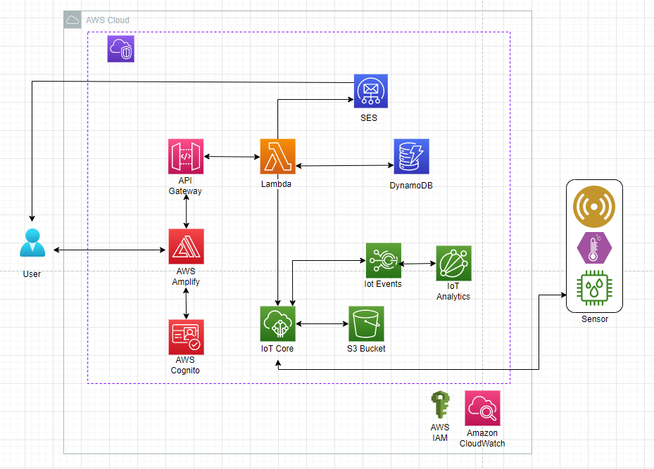

# Process

  ## 1) Cloud settings - region, budget

    - we defined the resource budget - AWS Console > Billing Dasboard > Budget
    - we defined the region for implementation as per customer's request - Region > Frankfurt

  ## 2) AWS component definition
  
    - as per customer's request, we selected the following AWS components: Lambda, SES, DynamoDB, IAM, S3, API Gateway

    Lambda - an event-driven serverless computing platform
    Simple Email Service (SES) - emnail platform enbaling sending and receiving of emails in HTML format
    DynamoDB - fully managed NoSQL database offering autoscalling and encryption At Rest features
    Identitiy and Access Management (IAM) - central management platform for AWS resource user access
    S3 - simple storage service
    API Gateway - fully managed services for API management 

  ## 3) IAM role definition

    IAM > Roles > Create Role

    In order to establish the connection between Lambda and other AWS components, the following IAM roles were defined:

    A) TRM_postRoomBooking-role-z1i9g8w9
        - permissions: AWSLambdaBasicExecutionRole-2741c49f-eb05-4f23-8fbb-a56fe62f5cee, SESFullAccess, DynamoDB-Putitem
        
    B) TRM_deleteBooking-role-z0itjt76
        - AWSLambdaBasicExecutionRole-8653ab0f-9a33-4848-b058-b926101e04c0, DynamoDB_Delete-Update_Item, SESFullAccess
        
    C) TRM_getRoomVacancy
        - AWSLambdaBasicExecutionRole-02040bd4-28c8-4a34-8676-d0c80f0ca52c, 
          AWSLambdaSNSTopicDestinationExecutionRole-d1d0e6aa-7f49-4fa8-b7b7-1554989d1c27, TRM_Lambda_Get_Data

   ## 4) APIs definition

    API Gateway > Create API 

    A) TRM_RoomBooking_API - Rest API, connects frontend with the room booking Lambda functions
    B) Methods: Post, Delete, Get, Put

    API Gateway > Create Authorizers
    
    A) Authorizers: TRM-api-authorizer - after verify in cognito, the authotizer checks the User ID authentification, 
       befor calling the API 

    API Gateway > Create Stages

    A) Dev: Post, Delete, Get, Put
    B) Invoke URL: https://tgjdqpmdj0.execute-api.eu-central-1.amazonaws.com/Dev/ - connects frontend for check the Token 
       for authentification
  
   ## 5) Lambda Function definition

     Lambda > create functions

     A) TRM_postRoomBooking - when triggered, the function posts booking details into DynamoDB and sends an email notifaction 
        through SES to an end user

     B) TRM_deleteBooking - when triggered, the function deletes booking details in DynamoDb and send an email notification 
        through SES to an end user

     C) TRM_getRoomVacancy - when triggered, the function retrieves data from DynamoDB and sends it to frotend in order to 
        display conference room vacancies
   
     D) TRM_UpdateBooking - when triggered, the function will update the booking details in DynamonDB and send an email 
        notification through SES to an end user

  ## 6) DynamoDB table definition

     DynamoDB > create table

     A) TRM_MeetingRoom_Booking - the table stores booking information such as the booking code, date, time, employee ID 
        and the meeting room name
      - Partition Key: booking_code
      - Sort Key: booking_date

     B) UserList - the table stores the user information such as user names and email addresses
      - Partition Key: User Name

  ## 7) Notification workflow using SES
  
    SES > Email verification

    All functionalities are enabled through Lambda functions.
    
 
# Architecture

  ## Architecture Diagram

  

  ## Data Flow

    A) User accesses the web application using internal VPN connection through their mobile phone or corporate computer. 
    B) The web Application is hosted on AWS Amplify. 
    C) Before the user gets access to the booking system, the user is authenticated via AWS Cognito which then allows the web 
       application to make a call to the API through AWS API Gateway. 
    D) The API call triggers the AWS Lambda responsible for the room booking. 
    E) If successful, the room is booked and the booking information is sent to the AWS DynamoDB, a E-mail notification is sent to the 
       user with the booking information through SES.
    F) The sensor data flows through IoT Core to S3 Bucket, where the data is saved in json format
    G) Data Analytics in charts in IoT Analytics (todo)
    H) Cloud Watch (todo)

    1. booked room

    The AWS Lambda also sends information to AWS IoT Core which in turn automates settings such as Temperature, lighting, and booking 
    display in the booked room. 
    
    2. delete roombooking

    3. update roombooking

  
