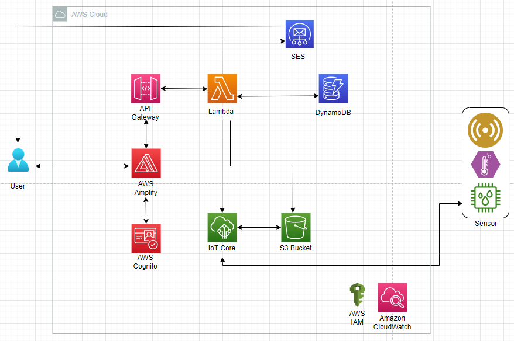

# Process

  ## 1) Cloud settings - region, budget

    - we defined the resource budget - AWS Console > Billing Dasboard > Budget
    - we defined the region for implementation as per customer's request - Region > Frankfurt

  ## 2) AWS component definition
  
    - as per customer's request, we selected the following AWS components: Lambda, SES, DynamoDB, IAM, S3, API Gateway

    Lambda - an event-driven serverless computing platform
    Simple Email Service (SES) - email platform enbaling sending and receiving of emails in HTML format
    DynamoDB - fully managed NoSQL database offering autoscalling and encryption At Rest features
    Identitiy and Access Management (IAM) - central management platform for AWS resource user access
    S3 - simple storage service
    API Gateway - fully managed services for API management 

  ## 3) IAM role definition

    In order to establish the connection between Lambda and other AWS components, the following IAM roles were defined:

    A) TRM_postRoomBooking-role-z1i9g8w9
        - permissions: AWSLambdaBasicExecutionRole-2741c49f-eb05-4f23-8fbb-a56fe62f5cee, SESFullAccess, DynamoDB-Putitem
        
    B) TRM_deleteBooking-role-z0itjt76
        - AWSLambdaBasicExecutionRole-8653ab0f-9a33-4848-b058-b926101e04c0, DynamoDB_Delete-Update_Item, SESFullAccess
        
    C) TRM_getRoomVacancy
        - AWSLambdaBasicExecutionRole-02040bd4-28c8-4a34-8676-d0c80f0ca52c, 
          AWSLambdaSNSTopicDestinationExecutionRole-d1d0e6aa-7f49-4fa8-b7b7-1554989d1c27, TRM_Lambda_Get_Data

   ## 4) APIs definition

    A) TRM_RoomBooking_API - Rest API, connects frontend with the room booking Lambda functions
    B) Methods: Post, Delete, Get, Put
    C) Authorizers: TRM-api-authorizer - after verification in Cognito, the authotizer checks the User ID authentification 
       and then calls the API 
    D) Invoke URL: https://tgjdqpmdj0.execute-api.eu-central-1.amazonaws.com/Dev/ - connects with frontend to check the Token 
       for authentification

| Methode  | Endpoint | Description | Response Body 1 | Response Body 2 | Response Body 3 | Response Body 4 | Response Body 5 | Response Body 5 |
| -------- | -------- | ----------- | --------------- | --------------- | --------------- | --------------- | --------------- | --------------- |
| Delete   | /Dev/' | Request to delete booking | Response {"statusCode": 400, "headers": { "Access-Control-Allow-Headers": "*", "Access-Control-Allow-Origin": "*", "Access-Control-Allow-Methods": "*" }, "body": "\"Booking not found.\"" } | Response {"statusCode": 400, "headers": { "Access-Control-Allow-Headers": "*", "Access-Control-Allow-Origin": "*", "Access-Control-Allow-Methods": "*" }, "body": "\"Booking not found.\"" } | Response {"statusCode": 200, "headers": { "Access-Control-Allow-Headers": "*", "Access-Control-Allow-Origin": "*", "Access-Control-Allow-Methods": "*" }, "body": "\"Booking has been deleted and email sent.\"" } | Response {"statusCode": 400, "headers": { "Access-Control-Allow-Headers": "*", "Access-Control-Allow-Origin": "*", "Access-Control-Allow-Methods": "*" }, "body": "\"Booking not found.\"" } | Response {"statusCode": 500, "headers": { "Access-Control-Allow-Headers": "*", "Access-Control-Allow-Origin": "*", "Access-Control-Allow-Methods": "*" }, "body": "\"Error.\"" } | 
| Get   | /Dev/' | Request to retrieve booking data | { "statusCode": "200", "headers": { "Access-Control-Allow-Headers": "*", "Access-Control-Allow-Origin": "*", "Access-Control-Allow-Methods": "*" }, "body": "\"{\\n  \\\"2\\\": [\\n   {\\n      \\\"start_time\\\": \\\"19:47\\\",\\n      \\\"end_time\\\": \\\"20:47\\\"\\n    }\\n  ]\\n}\"" }
| Post  | /Dev/' | Request to post new booking |

  
   ## 5) Lambda Function definition

     A) TRM_postRoomBooking - when triggered, the function posts booking details into DynamoDB and sends an email notifaction 
        through SES to an end user

     B) TRM_deleteBooking - when triggered, the function deletes booking details in DynamoDb and send an email notification 
        through SES to an end user

     C) TRM_getVacancy - when triggered, the function retrieves data from DynamoDB and sends it to frotend in order to 
        display conference room vacancies
   

  ## 6) DynamoDB table definition

     A) TRM_MeetingRoom_Booking - the table stores booking information such as the booking code, booking date, start time, 
        end time, meeting room, employee ID 

      - Partition Key: booking_code
      - Sort Key: booking_date

  ## 7) Notification workflow using SES
  

    A) All functionalities are enabled through Lambda functions
    B) Users receive email notifications when completing the action of creating, updating and deleting their bookings 
    
 
# Architecture

  ## Architecture Diagram

  

  ## Data Flow

    1. Create a room booking

    The API Gateway calls the Lambda Function TRM_postRoomBooking. The data are stored in the DynamoDB. The user get an email 
    notification with the meeting information.
    
    2. Deleting a room roombooking

    The API Gateway calls the Lambda Function TRM_deleteBooking. The stored Data from the booking of the Meetingroom are delete 
    in the DynamoDB. The user get an email notification with the deleted information.

    
    

  
