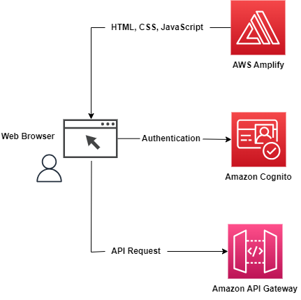
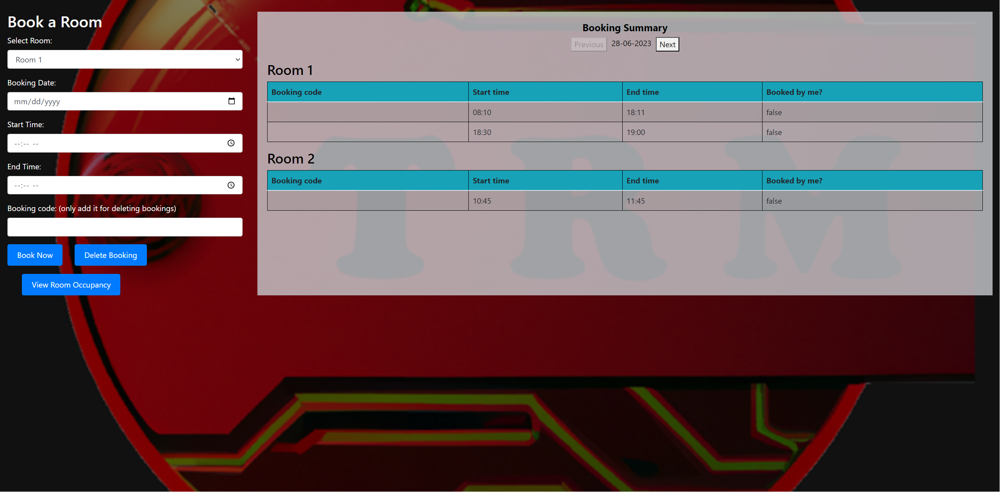
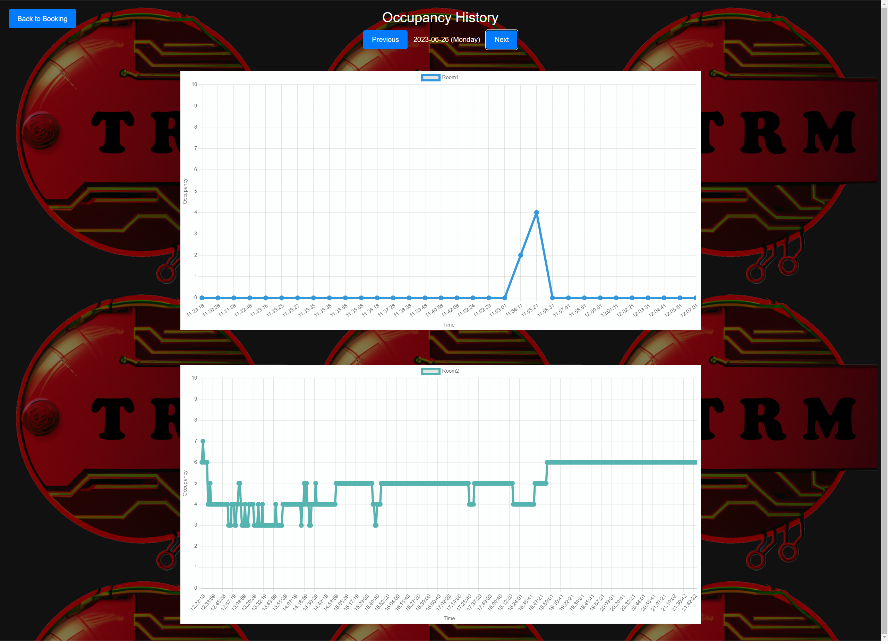

# **Documentation Frontend**

## **Content**
- Architecture Overview
- AWS Amplify
- Amazon Cognito
- Amazon API Gateway
- Other used services

 

## **Architecture Overview Frontend**
This architecture diagram shows the connections between the web browser and the used AWS services
- AWS Amplify
- Amazon Cognito
- Amazon API Gateway

      

## **AWS Amplify: Hosting the websites**
HTML files to sign-in, book rooms and see the occupancy of the rooms. The sites are showing textfields, buttons, links, tables and graphs.

- Sign in or register

    

- Register

    

- Verify

    

- Sign In

    

- Forgot Password

    

- Reset Password

    

- Room Booking

    

- Room Occupancy

    

 

## **Cognito: User verification, access management**
Cognito manages the user verification.
After a registration request, the requester gets an email with a verification code. Only with this code and the provided email a complete registration is possible. The successfully following sign-in process leads to the booking page. Only if a valid token is send to the backend the booking of a room is possible.

API calls against Cognito:
- GET: retrieve the authorization token
- POST: user registration with email and password, verificationcode

 

## **Amazon API Gateway**
- API calls against the booking system:
    - GET: retrieve of booking information and sending authorization token in the header
    - POST: send the booking data: room ID, booking date, start- and end-time of the booking and the authorization token in the header
    - DELETE: send the unique booking code, room, date and authorization token in the header

- API calls against the occupancy system:
    - GET: retrieve real time sensor data

 

## **Other services or tools**
- For coding: Text Editor Visual Studio Code
- Versioning tool: Git
- Collaborative work: GitHub for the project to share it
- ToDo Board on GitHub
- Canvas chart to display the occupancy graph
- AWS SDK
- HTML for the web sites
- CSS for styling the web sites
- Bootstrap to make web sites responsive
- JavaScript for coding the script
