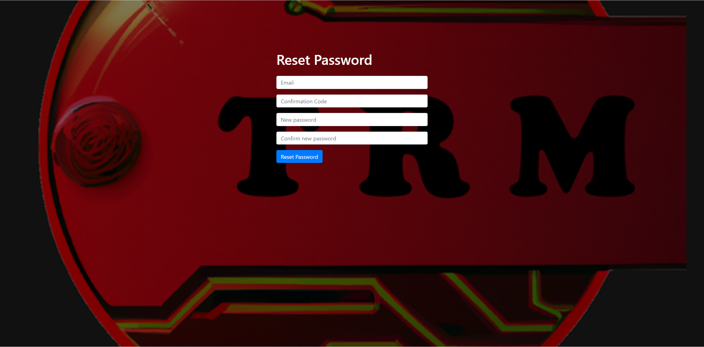

# Documentation for Front-End

## Content
- Architecture Overview
- Text Editor Visual Studio Code
- Amplify
- Cognito
- HTML, CSS, JavaScript, API GET POST DELETE

## Architecture Overview {#architecture-overview}

### Whole Project Archictecture
to be created

### Architecture Frontend-Part
to be created

## Amplify for hosting the websites in the cloud

### Login sites with textfields, buttons, links
- Sign In

    

- Forgot Password

    

- Reset Password

    

- Initial Password Change

    

## Cognito for user verification, access management

